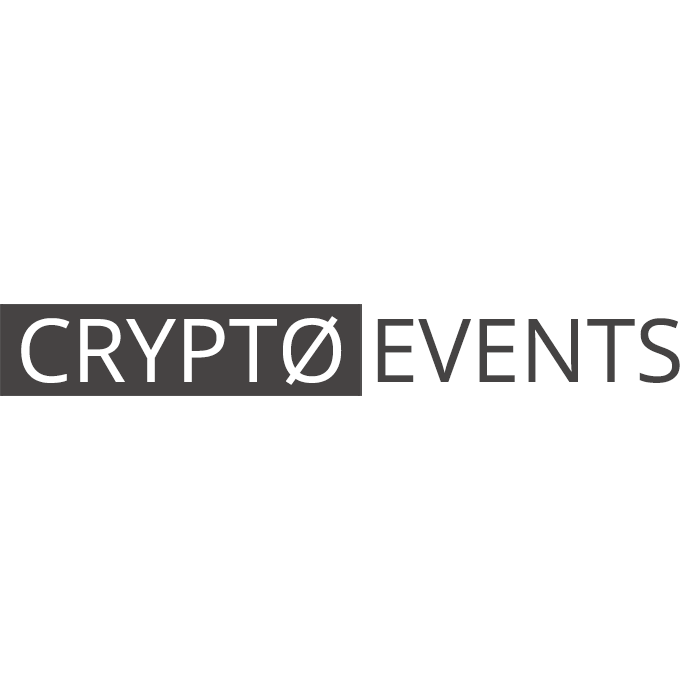

import Card from '~/components/TextCard.vue'
import Button from '~/components/Button.vue'

Robonomics Winter School 2021 is inviting all willing to join master classes and lectures hosted by experienced contributors and programmers operating with Dapps and Web services on the Polkadot Parachain.

The opening ceremony will launch on Wednesday, February 10, at 7:00 PM GMT+3.

The main event with all master classes and lectures will be taking place from the 11th to the 24th of February.

## Topics to be discussed:

* What are Robonomics and Robonomics parachain? 
* How can you use a set of software for connecting IoT devices using the HTTP/MQTT protocol, complex robotic systems using the Robot Operating System (ROS)? 
* Decentralized cloud infrastructure for IoT. 
* How to create digital twins on the blockchain. 
* App Store for robotics.

Master classes include overviews of Robonomics io, using prepared digital twin templates for connecting with services, using Robonomics.js to interact via Dapps with digital twins of devices, and much more.

<section class="animate-inside" v-in-viewport.once>
<Card :orientation="'vertical'" :link="'https://discord.gg/5UWNGNaAUf'" :back="'gradient'">

## Join Robonomics Winter School Community

Meet likeminded people, get rewards and chat with core Robonomics developers. 

<Button :link="'https://discord.gg/5UWNGNaAUf'" :label="'Sign up'" :button="'primary large orange'"/>

</Card>
</section>

## Robonomics Winter School 2021 Shedule

<table class="mobile fullwidth">
<thead>
<tr>
<th style="width:110px">Date</th>
<th style="min-width:190px">Lesson</th>
<!-- <th>Description</th> -->
<th>Contributors</th>
</tr>
</thead>
<tbody>
<tr>
<td data-th="THE OPENING CEREMONY">Feb 10, 2021</td>
<td>The opening ceremony</td>
<!-- <td data-th="FEB 10, 2021 - THE OPENING CEREMONY">All contributors will take a word about winter school and their master classes.</td> -->
<td data-th="Contributors:">All Robonomics Team</td>
</tr>
<tr>
<td data-th="CONNECT ROBOTICS TO USER APP">Feb 11, 2021</td>
<td>Connect robotics to user app</td>
<!-- <td data-th="FEB 11, 2021 - WHAT'S ROBONOMICS?">Robonomics is an open-source platform for IoT applications. We support a new generation of internet technologies (web3) that implements the exchange of technical and economic information in the form of atomic transactions between user applications, IoT services, and complex robotics.</td> -->
<td data-th="Contributor:">@ensrationis</td>
</tr>
<tr>
<td data-th="ROBONOMICS GITHUB OVERVIEW">Feb 12, 2021</td>
<td>Robonomics GitHub overview</td>
<!-- <td data-th="FEB 12, 2021 - HOW TO BUILD ON ROBONOMICS">You'll explore the basic skills to work with Robonomics.</td> -->
<td data-th="Contributor:">@ensrationis</td>
</tr>
<tr>
<td data-th="ROBONOMICS IO IN PRACTICE">Feb 15, 2021</td>
<td>Robonomics IO in practice</td>
<!-- <td data-th="FEB 15, 2021 - ROBONOMICS CONNECTIVITY">For the developers’ convenience, Robonomics contains a set of software for connecting: IoT devices using the HTTP/MQTT protocol, complex robotic systems using the Robot Operating System (ROS).</td> -->
<td data-th="Contributor:">@akru</td>
</tr>
<tr>
<td data-th="ROBONOMICS PARACHAIN IN PRACTICE">Feb 17, 2021</td>
<td>Robonomics parachain in practice</td>
<!-- <td data-th="FEB 17, 2021 - CONNECT DIGITAL TWINS WITH YOUR SERVICES">Blockchain enables the shared single version of the truth as to the state of these things across their life cycles and associated business events. Robonomics Parachain provides an opportunity to create a model of a digital twin and update its state every 6 seconds.</td> -->
<td data-th="Contributor:">@akru</td>
</tr>
<tr>
<td data-th="ROBONOMICS CONNECTIVITY">Feb 19, 2021</td>
<td>Robonomics Connectivity</td>
<!-- <td data-th="FEB 19, 2021 - DECENTRALIZED CLOUD INFRASTRUCTURE FOR IOT">Robonomics Web Services (RWS) is the basic infrastructural service for Robotics and IoT on top of Robonomics Parachain and IPFS.</td> -->
<td data-th="Contributor:">@vourhey</td>
</tr>
<tr>
<td data-th="BUILD IOT DAPPS FOR END USERS">Feb 21, 2021</td>
<td>Build IoT Dapps For End Users</td>
<!-- <td data-th="FEB 23, 2021 - BUILD DAPP FOR END USERS">Using Robonomics.js, learn how to interact via dapp with digital twins of devices. Build IoT applications to transfer telemetry from devices to users, and also provide the ability to launch, for example, a robot vacuum cleaner using the Robonomics decentralized cloud.</td> -->
<td data-th="Contributors:">@vol4tim && @positivecrash</td>
</tr>
</tbody>
</table>

## Opportunity for developers and engineers

The Robonomics Winter School is an excellent opportunity for software developers and all interested to gain invaluable knowledge on working with the Robonomics Network and related packages for building Dapps and operating blockchain technologies and coding. The Robonomics Network invites all interested to join the courses and take advantage of the unique opportunity of gaining firsthand knowledge from industry experts. The courses will be hosted by Aleksandr Kapitonov (Dean of the Faculty of Infocommunication Technologies), Aleksandr Krupenkin (Robotics/IoT/Ethereum smart contract developer), Aleksandr Starostin (Web developer, Ethereum smart contract developer), Vadim Manaenko (Robotics and IoT engineer, drones developer), Anastasiia Bakai (UI, Motion Design, Front-end), Sergei Lonshakov (Robonomics co-founder and software architect).

<section class="animate-inside" v-in-viewport.once>
<Card :orientation="'vertical'" :image="'/posts/robonomics-school/join.png'" :imageSize="'big'" :imageRound="false" :link="'https://discord.gg/5UWNGNaAUf'" :back="'gradient'">

## Join Robonomics Winter School Community

Meet likeminded people, get rewards and chat with core Robonomics developers. 

<Button :link="'https://discord.gg/5UWNGNaAUf'" :label="'Sign up'" :button="'primary large orange'"/>

</Card>
</section>

## Info partners

<section class="grid-4 animate-inside" v-in-viewport.once>

<Card :orientation="'vertical'" :link="'https://raec.ru'" :classList="'pin'">

</Card>

<Card :orientation="'vertical'" :link="'https://events.dev.by/robonomics-winter-school'">

</Card>

<Card :orientation="'vertical'" :link="'https://interestingengineering.com/events/robonomics-winter-school-2021'">

</Card>

<Card :orientation="'vertical'" :link="'https://bitcoinist.com/robonomics-winter-school-2021-master-classes-and-lectures-open-for-attendees/'">

</Card>

<Card :orientation="'vertical'" :link="'https://www.newsbtc.com/press-releases/robonomics-winter-school-2021-master-classes-and-lectures-open-for-attendees/'">

</Card>

<Card :orientation="'vertical'" :link="'https://cryptoevents.global/'">

</Card>

<Card :orientation="'vertical'" :link="'https://bitnewstoday.com'">

</Card>

<Card :orientation="'vertical'" :link="'https://coincodex.com/'">

</Card>

<Card :orientation="'vertical'" :link="'https://www.youtube.com/channel/UCrvyFYM29oQ-EAejZgYqmWA'">

</Card>

<Card :orientation="'vertical'" :link="'https://forknews.io/'">

</Card>

</section>
