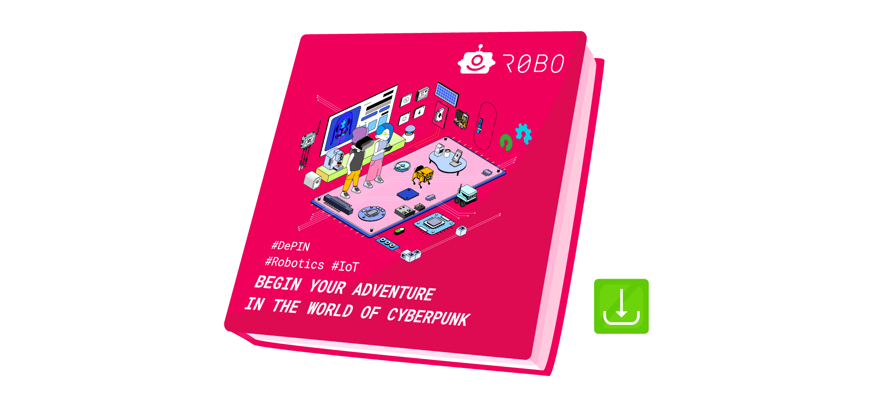

تلتقط هذه النشرة النتائج الرئيسية للعام الماضي وتقدم رؤية ملهمة لعام 2025. مواصلة لتقليد بدأ في عام 2017، توثق تطور تقنياتنا ونهجنا، معرضة كيفية تحول روبونوميكس العالم.

## ما الذي بداخلها؟

تعتبر كل عدد دليلاً على الحافة الحديثة لتقنيات الإنترنت الحديثة والروبوتات. يتضمن مراجعة عام 2024 أحداثًا مثيرة وإنجازات وقصص ملهمة:

- **أجهزة للسيبربانكس — تكنولوجيا للناس:**
    
    في عام 2024، قدمت روبونوميكس حلولًا جديدة للأجهزة تجعل Web3 متاحة للجميع. كان تركيزنا على أجهزة ذكية مفتوحة المصدر، مثل مراقبي الطاقة ومستشعرات جودة الهواء وخوادم مستقلة للمنازل الذكية.
    
- **مختبر جوني بي:**
    
    باستمرار توسيع تشكيلة الروبوتات ورفع التجارب إلى مستويات جديدة، استقبل المختبر:
    
    - **تيرتل بوت 4** — منصة متنقلة مع رؤية الحاسوب.
    - **ميني بابر** (الإصدارات 1 و 2) — روبوتات بأربعة أرجل متكاملة مع Web3.
    - **ماي بادي 280** — روبوت ذو ذراعين مثالي للمهام متعددة الوكلاء.
    - **يونيتري جي1 هيومانويد** — منصة تجريبية لدراسة تفاعل الإنسان مع الروبوت في عالم Web3.
    نحن لا نقوم فقط بتطوير الروبوتات — بل نعلمها كيف تزدهر في نظام البيئة Web3. اقرأ كيف تحولت تجاربنا الروبوتية إلى وكلاء مركزيين جاهزين للمهام العملية.
- **مشروع G.E.C.K.: منزل الذكي للمستقبل في بالي**
    
    تجربة في إنشاء منزل مستقبلي على جزيرة بالي، حيث تعتمد جميع أنظمة الإدارة على تقنيات Web3.
    
    **الفكرة الرئيسية:** دمج الأشياء المادية مع Web3 لإنشاء منازل ذاتية الإدارة تقدم الراحة والاستدامة والاستقلالية عن الأنظمة المركزية في أي مكان في العالم.
    
    يعد مشروع G.E.C.K. أكثر من تجربة؛ إنه خطوة هامة نحو بناء منازل تجسد فلسفة Web3: الحرية والاستقلالية والاستدامة.

- **ابتكارات وقصص نجاح Web3:**
    - **تحكم منزل ذكي وإنجازات بينوت:** كانت أحد أبرز الأحداث في العام تحكم المنزل الذكي مع دمجه في الشبكات اللامركزية. يولى اهتمام خاص لـ **بينوت**, مكامل منزل ذكي في قبرص.
    - **معلم جوني بي:** كدليل Web3، أجرى جوني بي محاضرات وفعاليات في عام 2024، يكشف عن استخدام الشبكات اللامركزية في الروبوتات وأنظمة الإنترنت للأشياء وDePIN.
    - **Web3 في الترفيه — درون سيلفي:** مشروع محوري يعرض كيف تعيد تقنيات Web3 تعريف صناعة الترفيه، وتقدم حزم وسائط شخصية مخزنة بشكل آمن في شبكات لامركزية.
    - **تجربة فنية وجوازات سفر رقمية:** في عام 2024، حصلت الأعمال الفنية على جوازات سفر رقمية من خلال Web3، توثيق إنشائها في سلسلة الكتل. عرضت استوديو متنقل مع إضاءة ذكية التكامل السلس للتكنولوجيا والفن.

- **خطط لعام 2025:**
    تركيز قوي على بولكادوت، وإطلاق أجهزة جديدة، وتقدم مفهوم الإدارة اللامركزية للمنازل الذكية والروبوتات.

## لماذا قراءة هذه الطبعة؟

تعتبر كل منشور سجلاً حيًا لروبونوميكس، يعكس رحلتنا من تجارب الإنترنت للأشياء المبكرة والبلوكتشين إلى تنفيذ حلول Web3 الحديثة. تقنيات الأجهزة وتجارب الروبوتات وحالات الاستخدام الابتكارية تظهر كيف تشكل التقدم التكنولوجي المستقبل.

**عام 2025 يعد بأن يكون عامًا حاسمًا للمشروع. انضم إلينا لاكتشاف ما دفع روبونوميكس في عام 2024 واستلهم من خططنا للمستقبل. قم بتنزيل هذه الطبعة وكن جزءًا من عالم يخدم فيه التكنولوجيا الناس والكوكب!**

لقد كنا ننشر الألماناك منذ عام 2017، نوثق تقدمنا وتحولاتنا التكنولوجية. إذا لم تقرأ الطبعات السابقة بعد، فإننا نوصي بشدة باستكشافها لرؤية كيف تطور المشروع. 

https://robonomics.network/books/