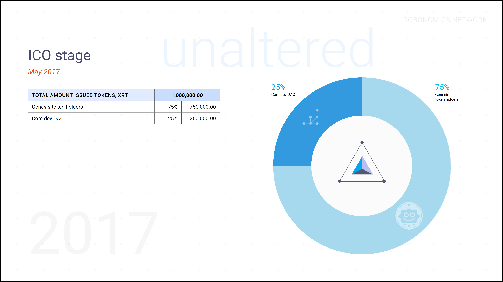
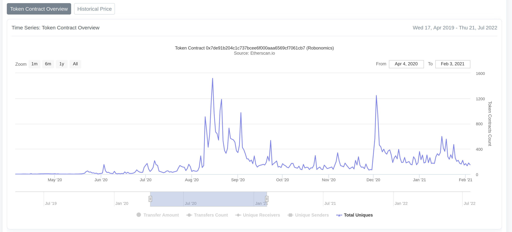

import Card from '~/components/TextCard.vue'

Ağıllı və mürəkkəb aparat dünyasında, kripto dünyasından fərqli olaraq, həyatın tempi tamamilə fərqlidir. Məsələn, məşhur robot texnikası şirkəti olan Boston Dynamics, ilk tam hüquqlu kommersiya məhsulunu bazara çıxararkən 25 ildən çox tədqiqat və inkişaf işlərini geridə qoydu. Və daha sadə görünən IoT həllərinin başqa bir yaxşı nümunəsi: Zigbee, MQTT və LoRa protokolları, lakin onlar 2000-ci illərin ortalarında yaranmışdılar. Robototexnika və yeni internet texnologiyalarının kəsişməsində yerləşən Robonomika layihəsinin yaranma tarixinə nəzər salarkən bunu unutmayın.

*Saytda 2015-ci ildəki ilk təcrübələrdən bəri layihənin inkişaf trayektoriyasını görə bilərsiniz: [https://robonomics.network/timeline/](https://robonomics.network/timeline/)*

Tezliklə bizim ilk icma səsverməmiz olacaq və bu, Damokl qılıncı kimi üzərimizdən asılı olan 7 milyon XRT-ni yandırmaq haqqında olacaq.

## XRT-NİN İLK PAYLAŞMASI TARİXİ

2015-ci ildə robotları idarə etmək üçün ağıllı müqavilələrin istifadəsi ilə bağlı ilk təcrübələr və nəşrlərlə başlamışıq, 2017-ci ilə qədər [Robot-as-a-Service](https://en.wikipedia.org/wiki/Robot_as_a_service)  tapşırıqlarında əlavə Ethereum xüsusiyyətlərini həyata keçirmək üçün Robonomika yaratmaq üçün ilk planımız var idi. Sonra biz icma və layihənin tərtibatçıları arasında təklif olunan ilkin emissiyanın 10%-ni paylayaraq XRT tokenlərinin ilkin paylanmasını həyata keçirdik. 

Qalan 9 milyon XRT, layihə tərtibatçıları DAO tərtibatçıları (20%) və icma (70%) arasında bölüşdürməyi təklif etdilər, lakin yalnız 2018-2019-cu illərdə planlaşdırılan Ethereum-da Robonomikanın tam işə salınmasından sonra.

Və sonra kripto qışı gəldi...

Biz 2018-ci ildə beta testində Robonomikanı işə saldıq və 2019-cu ilin aprelində layihənin smart müqavilələrinin [1.0.0](https://github.com/airalab/robonomics_contracts/releases/tag/v1.0) versiyasını buraxdıq.

Lakin 2018-ci ilin sonuna qədər əsas tapşırığlar kök komandanı saxlamaq və sonra 2020-ci ilə qədər real görünən Ethereum 2.0 ərəfəsində işləməyə davam etmək idi.

Bazardakı ümumi vəziyyətdən asılı olmayaraq bu hadisənin ilk kriptovalyutaların 50-90% düşməsi fonunda daha uyğun olacağını inanaraq, XRT-nin ilkin tədarükünün 70%-nin paylanmasını Ethereum-un ikinci versiyasının buraxılışına qədər təxirə salmaq qərarına gəldik. XRT-nin qalan 20% -i, layihənin tərtibatçıları, Serenity-nin buraxılması ilə eyni vaxtda baş verməli olan icma aktivləşdirilənə qədər toxunmamağa razılaşdılar. Ümumiyyətlə, kripto qışının əvvəlində Ethereum 2.0 çovğun zamanı bizim mayakımız oldu.

Çətin idi, bəzi layihə iştirakçılarını itirdik və hər ay asanlaşmırdı. Ancaq yenə də Robonimika üzərində işləmək üçün bir yol tapmaq arzusu ən azı 5-6 tərtibatçı tərəfindən qorunmağa davam etdi. Həmin il biz Gavin Wood-un rəhbərlik etdiyi bütün Ethereum cəmiyyətinə artıq tanış olan Parity komandasından Ethereum 2.0-a bənzər blokçeyni sınamağa qərar verdik. Beləliklə, biz Polkadot üçün tətbiq üzərində işləməyə başladıq.

2019-cu ilin ortalarına qədər Robonomikanın tərtibatçılar komandası Substrate-də öz şəbəkəsini/blok zəncirini işə salan ilklərdən biri oldu. Və 2020-ci ilin yazına qədər Polkadot üçün Robonomikanın tətbiqi, IoT bazarına girməzdən əvvəl kripto cəmiyyətinə təqdim etmək istədiyimiz demək olar ki, bütün əsas funksiyalara sahib idi. Bir neçə il pulsuz işlədik, Çin əriştəsini yeyib, diaqramlar çəkdik.

Və sonra kiçik bir möcüzə baş verdi...

Geniş miqyaslı DeFi seqmentinin (xüsusən, 2020-ci ildə Uniswap) ortaya çıxması, bütün kriptovalyuta cəmiyyətinin Polkadot layihələrinə marağı və mövcud Ethereum əsaslı tokenomikanın olması XRT-ə marağı yerindən oynatdı.

İcma 2021-ci ilə qədər əhəmiyyətli dərəcədə böyüdü. XRT tokenlərinin sahiblərinin sayı 2017-ci illə müqayisədə çoxaldı, token bir çox birjalarda satılmağa başladı. Robonomics ətrafında həyat qaynamağa başladı, layihə kripto qışından sonra inkişafını davam etdirdi. Və bu gün 2017-ci ilin planlarını 5 ildən sonra həyata keçirməyə çalışmaq yox, bütün cəmiyyətin gələcəyinə diqqət yetirmək vacibdir. Beləliklə, sual yarandı: bütün icma üçün Damokl qılıncına çevrilən ilkin emissiyanın 70% -i ilə nə etmək lazımdır?

## ROBONOMICS TOWN HALL SUMMER 2022

Avqustun son həftəsində (28 avqust-3 sentyabr) layihənin inkişafı üzrə XRT tokenlərinin müzakirəsində və səsverməsində ilk dəfə iştirak etməyə hazır olun.

İndicə oxuduğunuz məqalə 7 milyon XRT tokeninin yandırılması məsələsində səsvermə üçün müşayiət olunan məlumatlara istinad edir. Aşağıda tərtibatçıların DAO-nun cəmiyyətə təklif etdiyi və növbəti yazıda danışacağımız daha 4 səs var.

Cəmiyyət üçün suallar:

1. 7 milyon XRT yandırmaq üçün səs verin
2. Parachain Governance version 2 R&D
3. ROS2 dəstək qrantları
4. Home Assistant dəstək qrantları
5. Web3 ağıllı ev ekosisteminin maliyyələşdirilməsi sorğusu

## XRT YANDIRMA SƏSVERMƏ MEXANİZMI

Robonimika artıq iki şəbəkənin üstündə yaşayır. Və biz Ethereum və Kusama üçün ən əlverişli yollarla səs verəcəyik. Ethereum vəziyyətində biz Snapshot-ı seçdik və Polkadot vəziyyətində yerli Gov v1 referendum mexanizmi tətbiq olunacaq.

Bir ay ərzində XRT sahibi lehinə və ya əleyhinə səs verə biləcək. Səslərin çəkisi balansdakı tokenlərin sayına bərabər olacaq. Ayın sonunda iki səsin dəyəri yekunlaşacaq - əgər səs verilmiş tokenlərin ümumi sayının 51%-i “lehinə” olarsa, Hollandiya auksion müqaviləsinin bütün qalığı sobaya göndəriləcək. Səslərin 51% -i "əleyhinə" olarsa, o zaman auksion balansından tokenlərin sonrakı paylanmasını daha çox fərqləndirmək üçün başqa bir seçim axtaracağıq. Yaxud 5 il əvvəl planlaşdırdığımız kimi Ethereum 2.0-ın istifadəyə verildiyi gün 7 milyon tokenlik hərrac keçirəcəyik, lakin görünür ki bu 2032-ci ildə tez baş tutmayacaq. 😄