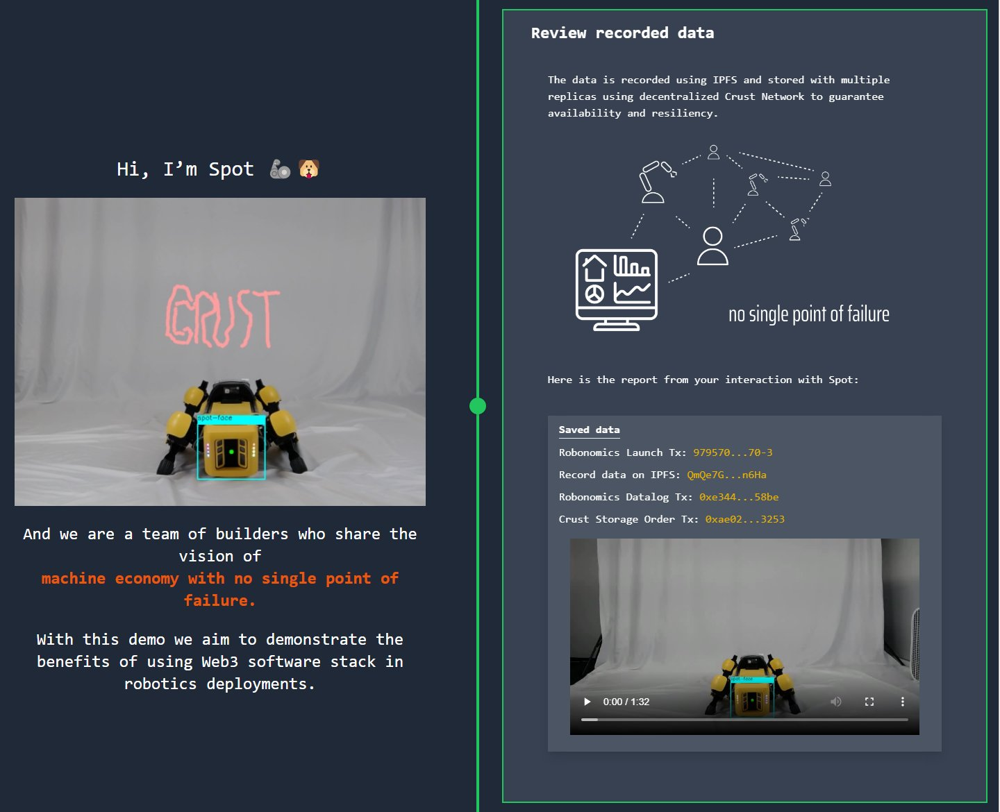

import RoboList from '~/components/blocks/List.vue'
import RoboListItem from '~/components/blocks/ListItem.vue'

Crust və Robonomics-in robototexnika və ağıllı cihazlara davamlı məlumat saxlama infrastrukturu gətirmək üçün əməkdaşlığa başladığını elan etməkdən məmnunuq. Bu tərəfdaşlıq, Kusamadakı Crust və Robonomics parachainlərin arasında daha dərin inteqrasiyanın olacağı, həmçinin istifadəçi təcrübəsini sadələşdirmək üçün cross-chain əməkdaşlıq üçün maraqlı yeni yanaşmanın olacağı deməkdir.

Birlikdə əldə etmək istədiyimiz iki əsas məqsəd var:

<robo-list>
    <robo-list-item>
        Əşyaların İnterneti (IoT) və robototexnika cihazlarından gələn məlumatların davamlı saxlanması. Hal-hazırda, Robonomika parachain davamlı olmaq üçün həm robototexnika nəzarətçilərimizdə, həm də mərkəzləşdirilmiş bağlama xidmətlərində IPFS-dən istifadə edir. Crust-ın mərkəzləşdirilməmiş pinning xidmətinə giriş istifadəçilərə bir çox lazımsız saxlama yerlərində saxlama ilə bağlı kriptoqrafik sübut təqdim edəcək.
    </robo-list-item>
    <robo-list-item>
        dApp-ların mərkəzləşdirilməmiş hostinqi. Bu, əvvəllər mövcud olmayan bir şeydir və nəticədə, Robonomika dApps ənənəvi bulud provayderləri tərəfindən yerləşdirilməli və ya sahib olduğu avadanlıqdan istifadə edilməli idi. Crust ilə dApps mərkəzləşdirilməmiş hostinqə sahib ola bilər ki, bu da xidmətlərin mövcud qalacağına zəmanət verir. Tərtibatçıların qlobal miqyasda istifadəçilər üçün əlçatan qalacaq heç bir uğursuzluq nöqtəsi olmayan xidmətlər yarada bilməsi, robototexnika və ümumiyyətlə hər hansı fiziki dünya tətbiqi üçün son dərəcə vacibdir.
    </robo-list-item>
</robo-list>

  

Robonomika komandası artıq Crust şəbəkəsini tədqiq etməyə başlayıb və sənədləşdirməyə çalışqan yanaşmadan heyran olub. Siz artıq [Boston Dynamics robotunu Bay Area](https://spot.merklebot.com) laboratoriyasında Robonomika parachain əməliyyatı vasitəsilə işə sala bilərsiniz, halbuki məlumatlar Crust-da qeyd olunacaq. Bunu [spot.merklebot.com](https://spot.merklebot.com). saytında sınamaqdan çekinmeyin.

İndi biz Crust Shadow və Robonomics parachainləri arasında XCM inteqrasiyasına diqqət yetirəcəyik. Bu, bizə tam mərkəzləşdirilməmiş şəkildə smart cihazlardan birbaşa saxlama üçün əməliyyatlar göndərməyə imkan verəcək. Qeyd etmək lazımdır ki, xidmətlər bir parachain tərəfindən digərinə çatdırıldıqda əməliyyat haqları ilə bağlı maraqlı suallar toplusu var və onlara cavab verilməlidir.

Hesab edirik ki, istifadəçi yalnız istifadə etdiyi parachain daxilində əməliyyat üçün ödəniş etməlidir. Bizim vəziyyətimizdə, Robonomika parachain istifadəçisi məlumatları robototexnika və smart cihazlardan Crust Network-ə saxlamaq istədikdə - onlar yalnız XRT-də xidmətlər üçün ödəniş etməli olacaqlar.

Robonomika parachain, məlumatları saxlamaq və birbaşa CSM tokenlərində Robonomika parachain hesabından ödəmə tələbi ilə Crust Shadow-a əməliyyat göndərə biləcək xüsusi bir palet yerləşdirmək üzərində işləyir. Saxlama xərclərini avtomatik kompensasiya etmək üçün istifadəçidən müəyyən XRT tutulacaq.

Nəhayət, parachainlər əlavə xidmətlər təklif edən digər parachain tokenlərinin balansını artırmaq üçün avtomatik olaraq DEX-də yerli tokenləri satacaqlar. Bu tam mərkəzləşdirilməmiş və muxtar ssenarinin artıq real olduğunu başa düşmək nəfəs kəsicidir!

Biz robototexnika, IoT və ağıllı cihazlar sahəsində həqiqətən mərkəzləşdirilməmiş həllər üzərində əməkdaşlıq edərək maraqlı gələcəyi gözləyirik.

## CRUST HAQQINDA

Crust Network çox yönlü, məqsədyönlü şəkildə qurulmuş saxlama blokçeynidir və bütün Web3 ekosistemi üçün həqiqətən qeyri-mərkəzləşdirilmiş fayl saxlama və hostinq imkanları təqdim edir, məxfilik və məlumat sahibliyini gücləndirir. Crust Network dApp hostinqinə, NFT metadata saxlanmasına və geniş çeşiddə blokçeynlərdə, eləcə də biznes işlərində şifrələnmiş fayl saxlanmasına imkan verir.

İndi Crust Network-ə qoşulun və 2300-dən çox qovşaqda təxminən 1000 Pb yaddaşa çıxış əldə edin!

[Website](https://crust.network/) | [Twitter](https://twitter.com/CommunityCrust) |[Wiki](https://wiki.crust.network/) | [Telegram](https://t.me/CrustNetwork) |[GitHub](https://github.com/crustio) | [Facebook](https://www.facebook.com/CrustNetwork/) | [Discord](https://discord.gg/wjDDpb5)

[Decentralized Cloud Foundation](https://decloudf.com/) | [Uniswap](https://medium.com/crustnetwork/decentralized-uniswap-interface-hosting-on-ipfs-18a78d1209ac) | [Polkadot](https://dotapps.io/) | [NFTs](https://medium.com/@bluna.io/bluna-future-of-metaverse-b7fc96fcff6a)

## ROBONOMİKA HAQQINDA

Robonomics IoT tətbiqləri üçün açıq mənbə platformasıdır. Biz istifadəçi proqramları, IoT xidmətləri və mürəkkəb robot texnikası arasında atom əməliyyatları şəklində texniki və iqtisadi məlumat mübadiləsini həyata keçirən yeni nəsil internet texnologiyalarını (web3) dəstəkləyirik.

Robonimika həm robototexnika, həm də istifadəçi interfeysi tərəflərində IoT tətbiqlərini inkişaf etdirmək üçün tam alətlər dəstini ehtiva edir. İstifadəçi və cihaz arasında əlaqə Web3 dünyasının ən uğurlu texnologiyalarından – IPFS, Ethereum və Polkadotdan istifadə etməklə baş verir. Beləliklə, tərtibatçılar Ağıllı Evdən Sənaye 4.0-a qədər müasir və təhlükəsiz proqramlar yarada bilərlər.

[Website](https://robonomics.network) | [Twitter](https://twitter.com/AIRA_Robonomics) | [GitHub](https://github.com/airalab/) | [Wiki](https://wiki.robonomics.network/en/) | [Discord](https://discord.gg/PuBEDkTzSx) | [Blog](https://robonomics.network/blog/)
