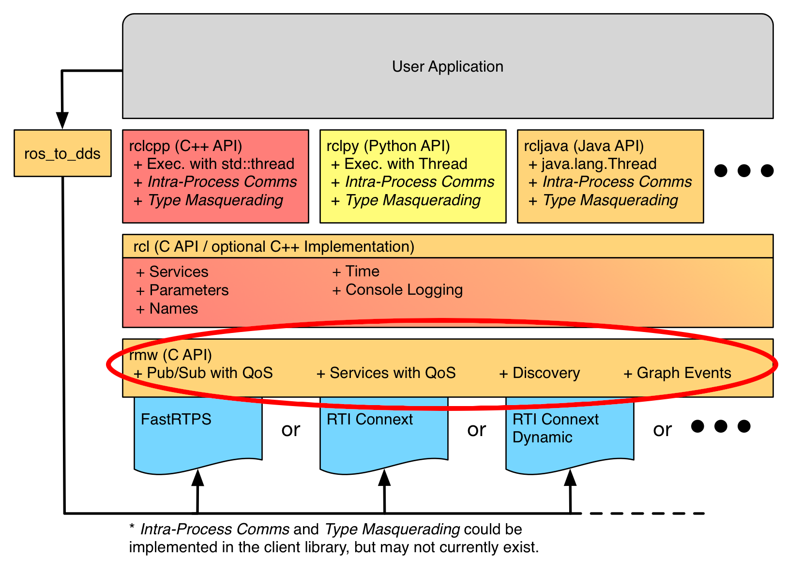

import Card from '~/components/TextCard.vue'

## From ROS 1 to ROS 2

ROS was initially created as the development environment for specific types of robots. Primarily, the first version of the operating system was intended for single robots with computing resources on board and a reliable network connection with no need for real-time control. Accordingly, developers initially thought that ROS 1 would be best suited for research and academic applications.

However, ROS eventually went beyond the research community and was adopted for commercial use. To meet the needs of new use cases, developers set out to add new features, such as support for multi-robot and small embedded systems, and integration with real-time. They also decided to improve the API and incorporate new technologies that had emerged since the release of ROS 1. At the same time, they chose not to change the existing version of the Robot Operating System, as this would have had a major impact on existing applications. As a result [ROS 2](https://design.ros2.org/) was born. 

## About Esteve

Esteve was one of the original team who [started developing](https://www.ros.org/news/2016/04/dirk-thomas-esteve-fernandez-and-william-woodall-osrf-state-of-ros-2.html) the second version of ROS. He is a robotics engineer with more than two decades of experience in open source development and self-driving cars. Even after leaving the core ROS 2 team , he has continued to actively contribute to the project's repositories. 

One of Esteve's personal goals was to develop projects that enable developers to write ROS 2 applications in Rust (bindings, code generator and more), providing them with a powerful tool to create efficient, robust robotics programs. However, the project developed rather slowly at first, as Esteve worked on it practically alone for 4 years, in his free time. 

About a year and a half ago, we met Esteve and agreed to help him with the development of ros2-rust. Thanks to this, Esteve was able to allocate extra time to work on the project and attract more attention to it. The ROS2 community on Rust has grown, and others have also started to contribute to the project with reviews by Esteve. Now the [main repository](https://github.com/ros2-rust/ros2_rust) has 27 contributors, 75 forks and 466 stars on Github.

## Progress of Development

At the moment, ros2-rust has already implemented support for message generation, publisher/subscriber mechanism, clients and services. One of our big goals is to develop Robonomics as ROS 2 Middleware, and this requires adding a Robonomics transport layer for ros2-rust. To implement this functionality, support for the libP2P communication library is being added instead of the standard Data Distribution Service (DDS) for ROS2. DDS provides a publish-subscribe transport in a distributed discovery way, allowing any two programs to communicate without the need for a centralized tool like the ROS master. But DDS requires developing an additional bridge for adding Robonomics to ROS2, while libP2P allows native Robonomics integration.

*Diagram of the ROS client library API stack showing the position of the ROS 2 Middleware (rmw). Source: [ROS 2 Documentation](https://docs.ros.org/en/foxy/Concepts/About-Internal-Interfaces.html)*

## Why ROS2 on Rust?

Besides being the main language for Robonomics on Substrate, Rust has significant advantages for robotic applications.

Generally, for the most widely used robotic platforms intended for commercial and large-scale deployment, C++ is used, and so it was added first for ROS. This is due to its ability to work ‘close to the hardware’ and its suitability for robotic applications with limited computing resources. However, this also makes C++ more dangerous, as it is very easy to make a critical mistake during development, and these mistakes are only discovered later on real (and broken) hardware.

This is where the advantages of Rust come in. It enables low-level development, like C++, but with added memory safety. This safety comes without additional runtime costs, preserving the application's high execution speed. Furthermore, Rust makes the development of complex and risky robotic projects more efficient.

## Future Plans

In the near future, Esteve plans to add actions (asynchronous calls to a node’s functionality) in ros2-rust. They allow a client to track the progress of a request, get the final outcome, and optionally cancel the request before it completes. This, in particular, allows robots to create queries, for example, for navigation and localization purposes.

Long-term plans include building a ROS 2 prototype launched on top of the Robonomics Network. This will allow us to use Robonomics on Substrate to create a WebAssembly app that can run ROS2 from a browser on the Robonomics decentralized cloud. We look forward to a new course at [Robonomics Academy](https://robonomics.academy) dedicated to ROS 2 and working directly from any browser!