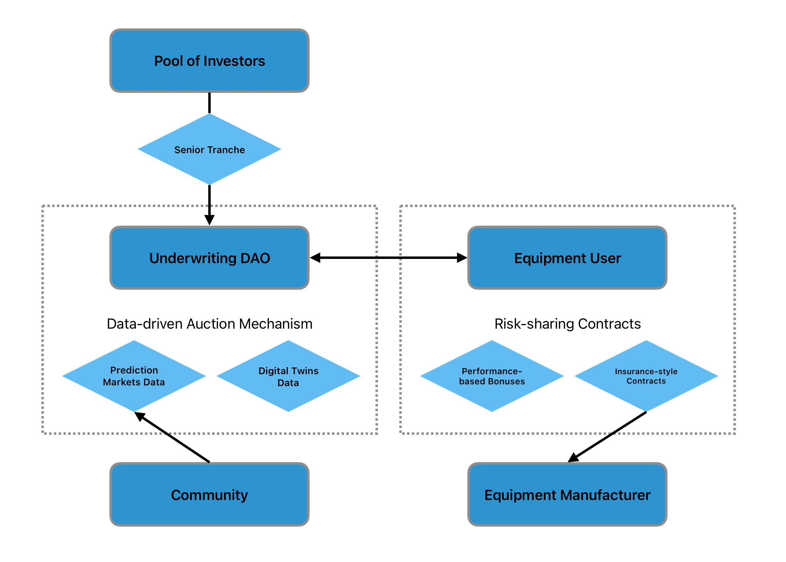

---

title: 强大的机制设计用于智能设备RWA市场

date: 2024-11-11

published: true

locale: 'zh'

tags: ['公告']

cover_image: ../images/ohf-part-1/cover.webp

description: "为快速发展的智能设备市场融资带来了重大挑战。本文提出了一种解决方案，结合了数字孪生体用于实时监控，预测市场用于有效资本配置，以及风险共担合同，所有这些都由透明的DAO模型管理，以实现在这个变革性行业中的最佳决策制定。"

---

最近机器学习（ML）的进展为机器人在现实世界中自动化新任务打开了大量机会。虽然工业机器人仍然是规模最大的部分，但服务机器人 - 那些在人群中操作的机器人 - 发展最为迅速。据估计，2023年专业服务机器人市场的美元价值约为**216亿美元**，复合年增长率为38%。机器学习的突破和劳动力短缺的增长创造了一个独特的时刻，服务机器人终于准备广泛实施，解决了跨行业和我们日常生活中的关键需求。

根据[IFR的说法](https://ifr.org/img/worldrobotics/Press_Conference_2024.pdf)，“中小企业（SMEs）需要轻松获得自动化”和“民主化”机器人是当前机器人领域的关键趋势。物流和仓储机器人已经引领这一趋势。城市交付机器人的首次部署已经开始，很明显，路线优化对保持利润至关重要。在疫情期间，医疗机器人经历了巨大增长，也成为自那时以来的主导类别之一，消毒和灭菌是主要的使用案例。酒店和餐厅的服务机器人在亚洲市场已经出现了大幅增长，我们开始在欧洲和美国看到它们的身影。农业、专业清洁、检查和维护、建筑和重工业、安全/搜救 - 新的应用领域列表不断增长。一些最乐观的预测称，未来十年我们可能会拥有比人类更多的类人机器人。

以下是根据国际机器人联合会的数据，2023年专业服务机器人的前五大应用领域列表：

然而，随着这些技术的发展，传统融资方法无法跟上智能设备租赁和机器人投资所面临的独特挑战。

**传统模式**，如贷款或租赁，通常**不适用于智能设备**，因为技术过时迅速、信息不对称和性能不确定性。机器人和人工智能技术发展迅速，使得长期投资存在风险，因为传统模式没有考虑到经常需要升级或改造的情况。制造商通常比承租人更了解设备性能，导致资本配置或效率方面的低效。错定价。此外，固定的付款计划未能反映真实的设备价值，特别是当性能取决于软件更新或集成时。金融机构在管理以人工智能驱动的资产方面缺乏专业知识，进一步导致对这些高潜力技术的投资不足。

智能互联设备需要更好的资本配置系统。这种系统将对创新的速度更快做出响应，并且能够应对不同市场参与者持有的不确定性和不对称信息。

## 坚固机制设计原则

机制设计是经济学和博弈论领域，专注于设计规则或系统（机制）以实现特定目标，即使参与者拥有私人信息并可能采取策略性行动或勾结。一个经典的例子是设计拍卖，其中竞标者对拍卖的商品有私人估值。

坚固机制设计中的一个关键挑战是处理**类型空间**——代理人的所有可能特征，如他们的偏好和信念。由于我们无法考虑所有可能的类型空间，机制必须设计成能够处理代理人可能不完全了解彼此偏好或信念的各种情况。

有许多**不同的代理人**可以直接参与设备交易，如**设备制造商（OEM）**、**集成商和维护提供商**、**资产发起人**、**承保人**和**投资者**。它们之间的协调涉及重大交易成本，更不用说解决更广泛的公共利益所涉及的额外复杂性了。尽管这些复杂性，互动中，我们的目标是开发一个强大的机制，确保以下几点：

- **确保所有市场参与者的激励兼容性**
- **分配资本以实现事后效率**
- **对市场条件和参与者信念的不确定性保持弹性**

让我用一个简单的例子来说明，以便更容易理解：

**激励兼容性**：想象一下，你正在玩一个游戏，需要告诉别人你喜欢不同糖果的程度。如果你说实话，你会得到你最喜欢的糖果。激励兼容性意味着你最好的选择是诚实，因为这样你会得到你真正想要的东西。换句话说，诚实是最明智的选择。

**事后效率**：在每个人分享他们喜欢的糖果之后，糖果被分发。事后效率意味着每个人最终得到他们最喜欢的糖果，没有糖果被浪费或分给不喜欢的人。它确保每个人都得到他们最喜欢的待遇，让每个人尽可能快乐地接受他们收到的东西。

我认为在引入诸如机器人和具身人工智能等重要新技术时，使用激励兼容的机制非常重要，这些技术有可能从根本上改变社会结构。确保这些机制强大是最大化社会利益并在部署变革性技术中实现公平、高效结果的关键。资本配置到新类别的智能设备的机制非常具有挑战性，这是由于该领域的复杂性和不断发展的特性。然而，我看到了一些机会，可以通过几种策略来增强这一机制的稳健性。

### **数字孪生及更多**

这是Robonomics的核心所在。在文章["数字孪生简介"](https://robonomics.network/blog/digital-twins-introduction/)中，我们解释了这个概念 - 物理实体或过程的数字表示。数字孪生不是静态模型，而是动态系统，不断接收来自其物理对应物的实时数据，从而实现持续更新和准确反映当前状态。这种持续的数据流使得精确的模拟和分析成为可能，促进了关于设备运行、维护和优化的知情决策。

为了有效捕获和管理智能设备的数据，Robonomics提供了一个名为[Otaberu](https://robonomics.network/blog/otaberu-part-1/)的开源工具。Otaberu旨在为边缘设备和机器人提供点对点（P2P）网络，实现设备之间的无缝和安全通信，无需进行复杂的网络配置。它为数字孪生的数据收集和管理提供了一个稳健的框架。

数字孪生作为在智能设备市场中实施稳健机制设计的基础层。通过提供对物理资产的全面和实时数字表示，数字孪生使得设备性能、使用模式和维护需求的精确监控和分析成为可能。这种详细的洞察力允许为了开发优化资本配置的复杂策略，确保资源被有效地引导以最大化回报并增强智能设备的寿命和生产力。

数字孪生在资本配置的背景下也引发了关于自主机器公司的讨论，这些公司受链上治理机制指导。这些自主实体可以根据市场输入独立执行决策，使它们能够管理资产、分配资源，甚至进行经济交易，无需人类干预。

### **预测市场**

预测市场和强大的机制设计都旨在从具有私人知识的代理那里获取真实信息，以实现高效结果。通过将预测市场整合到我们的机制框架中，我们可以通过确保决策反映最新和准确的信息来**提高资本配置决策的事后效率**，从而实现资源分配与实现结果更好地对齐。

以下步骤说明了该过程如何实施：

- 为考虑中的每类智能设备（送货车、包装机械等）建立一个预测市场。
- 允许广泛的利益相关者交易合同，基于设备未来性能指标，如正常运行时间百分比和维护成本。
- 使用市场价格反映关于设备是否会在租赁期内达到特定性能基准的集体信念。
- 如果预测市场表明设备有很高的概率表现良好（例如，正常运行时间长，维护成本低），则向租赁该设备分配更多资本。
- 相反，如果预测市场表明表现不佳，则减少资本配置或调整租赁条款以减少潜在损失。
- 预测市场参与者根据他们所下的赌注而获得奖励或被处罚。

预测市场允许有效地整合来自不同利益相关者的私人知识，实时更新绩效预期，并持续适应新信息，从而减少不确定性，实现更具弹性的机制设计。

当新信息变得可用，例如更新的智能设备数字孪生，预测市场价格会相应调整，从而实现资本的动态重新配置。这有助于减轻对表现不佳资产的过度投资风险，同时确保高表现资产在长期内获得适当的资金支持。

通过将资本配置与不断更新的市场洞察力相一致，承保人可以做出更明智的决策，优化其投资组合并降低财务风险。

### **风险共担策略**

风险共担策略在重塑智能设备的资本配置机制中发挥着至关重要的作用，有助于平衡风险并增加激励兼容性。传统的租赁安排相对僵化，通常依赖于固定付款，而不考虑设备的动态表现或意外变化。

可以采用类似保险合同或基于绩效的奖金等策略，创造一种更灵活和适应性强的方法，有效地共担风险，并导致更健壮的机制设计。

例如，保险式合同可以帮助分散意外停机的风险：如果数字孪生数据显示由于制造商缺陷导致意外停机，部分付款可能会被退还。这样，操作问题的财务负担得到缓解，每个人都有动力。维持绩效。

按结果付费模式提供了额外的风险共担层。机器即服务（RAAS）模式在机器人领域正日益流行，但在许多传统设备融资方眼中仍被视为新颖。通过将付款与技术带来的业务效益（比如一天内移动的箱子数量或自主交付中行驶的里程）联系起来，参与者被鼓励专注于实现切实的成果。

例如，如果物流机器人提高了仓库效率20%，那么这部分效率提升的一部分可以用来支付每月的付款。这种方法帮助企业将设备成本与自身的运营成功联系起来，在结果可能不太可预测的不确定时期降低财务风险。这里的对齐是双重的：企业感到更加安全，因为他们只按照他们获得的价值支付费用，而供应商则被鼓励提供可靠提供业务效益的设备。

随着能够实时生成数据的智能设备，强大的风险共担机制变得可行，允许对绩效问题做出动态响应，并围绕实际结果对齐激励措施。这种租赁结构的演变使市场参与者能够对技术变革做出灵活响应，确保采用先进设备的风险和回报更加公平地共享。实际上，关系变得更像是一种伙伴关系，而不是一种僵化的合同安排，促进信任并鼓励创新。

### **设备起源和核保的DAO治理**

建立支持未来3-5年内高效、激励对齐的资本配置的治理结构至关重要。随着机器人行业的形成，去中心化自治组织（DAO）是管理智能设备交易承销过程的理想治理结构。其主要目标是确定支持哪些新类别以及如何有效分配资本。

通过应用稳健机制设计原则，我们可以提高资源指向高价值投资机会的可能性，同时最小化与不对称信息和市场不确定性相关的风险。

承销DAO应该使用基于拍卖的机制对有前途的类别进行明智的投注。预测市场见解应增强估值的准确性，并在此处指导竞标策略。然后，一个自主流程可以根据承销DAO成员所持信念的独特组合，最优地分配资本。

随着初始资本汇集到DAO并进行分配，基于数字孪生数据的反馈循环开始推动进一步的决策。在这个阶段，更多投资者可以通过额外的分期开始参与，为数字资产投资者提供对冲、设备支持的产品。

决定向更大的汇集投资者社区提供哪些交易是至关重要的，成功的投注应该得到适当的奖励。这就是作为DAO治理一部分的价值所在，与投资到智能设备中的资本成比例的资产支持份额是分开的。

以下是这种DAO的操作简单方案：

## **实际考虑和 下一步**

这只是个开始。我的目标是创建一个强大的资本配置机制，使机器人革命的生产力增益对每个人都可获得。

上述想法提供了一个良好的起点，但需要考虑一些限制。如果参与者认为他们可以影响价格以获取个人利益，并且在早期阶段的流动性有限，他们仍可能参与战略行为。通过在预测和资本市场中提供足够的流动性，这些问题可以克服，但在早期阶段，仔细选择Underwriters DAO的成员是很重要的。

**启动新型智能设备类别资本配置强大机制的步骤:**

1. 启动预测市场以选择新的类别
2. 成立Underwriters DAO开始进行首次交易
3. 使用风险共担合同管理投资组合风险
4. 使用数字孪生数据进一步改善配置
5. 为更广泛的投资者参与机器人革命生产力增益开发结构

如果您有兴趣参与这个旅程或只是想提几个问题 - 请在下方留下您的电子邮件。

*Vitaly，Robonomics传道者*